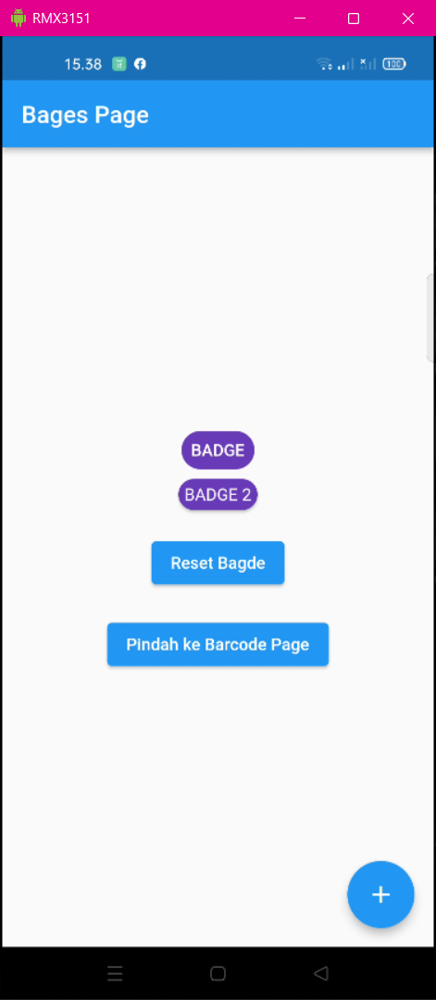
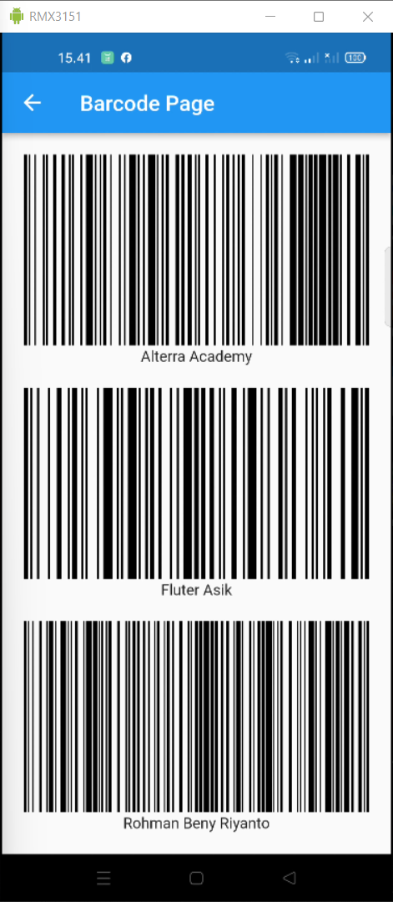

# (13) Flutter Command Line Interface (CLI) and Flutter package management
| NAMA |  KELAS
|--|--|
| Rohman Beny Riyanto  |  Flutter A

## Hasil Resume :

### 1. Apa itu flutter CLI
Flutter CLI adalah mekanisme interaksi dengan sistem operasi atau perangkat lunak komputer dengan mengetikkan perintah untuk menjalankan tugas tertentu.

### 2. Contoh Flutter CLI
```powershell
//Berikut adalah cara Anda dapat menggunakan flutter cli ini untuk membuat, menganalisis, menguji, dan menjalankan aplikasi:
 flutter create my_app
 cd my_app
 flutter analyze
 flutter test
 flutter run lib/main.dart

//Menjalankan pub
 flutter pub get
 flutter pub outdated
 flutter pub upgrade

 // Melihat semua perintah dalam flutter cli
 flutter --help --verbose

 //Melihat flutter sdk version
 flutter --version
```

### 3. Flutter Package
Di dalam flutter untuk menggunakan package sudah sangat dimudahka, karena package yang tersedia ada open source. Untuk mendapatkanya pun dapat langsung mengunjungi website flutter [pub.dev](https://pub.dev/)

#### Contoh Penggunaan
```
1. Memilih package apa yang akan di gunakan pada website pub.dev
2. Mendaftar kan package pada pubspec.yaml dengan cara "flutter pub add <nama package> pada CLI"
3. Melakukan pub get dapat melalui CLI "flutter pub get"
4. Melakukan import package. contoh : import 'package:<nama package>';
```

# Task
Pada task ini saya membuat aplikasi sederhana untuk menerapkan flutter CLI dan menggunakan flutter package badge dan barcode_widget.

berikut hasil dari praktikum ini :

[View Program](https://github.com/RohmanBenyRiyanto/flutter_rohman-beny-riyanto/tree/main/13_Flutter%20Command%20Line%20Interface%20(CLI)%20and%20Flutter%20package%20management/praktikum/task_section_13)<br>
[View Secreenshot](https://github.com/RohmanBenyRiyanto/flutter_rohman-beny-riyanto/tree/main/13_Flutter%20Command%20Line%20Interface%20(CLI)%20and%20Flutter%20package%20management/screenshot)

## Nomor 1.
Pada task pertama ini saya menggunakan package yang tersedia pada pub.dev, package yang saya gunakan adalah badge. Berikut hasil dari task 1 : [view](https://github.com/RohmanBenyRiyanto/flutter_rohman-beny-riyanto/blob/main/13_Flutter%20Command%20Line%20Interface%20(CLI)%20and%20Flutter%20package%20management/praktikum/task_section_13/lib/task_1.dart)

### Source Code : 
```dart
// Mendaftarkan package pada pubspec.yaml
   badges: ^2.0.2
// Melakukan import package pada class atau page yang akan menggunakan package
   import 'package:badges/badges.dart';

// MENGGUNAKAN PACKAGE

// Deklarasi property
   int _counter = 0;

// Membuat method yang akan digunakan untuk mengisi badge content dan di digunakan melalui button
   void add() {
     return setState(() {
       _counter++;
     });
   }

// Button yang akan menjalankan method untuk melakukan penambahan value pada badge
   floatingActionButton: FloatingActionButton(
      onPressed: () {
          add();
          },
          child: const Icon(Icons.add,
        ),
    ),

// Penggunaan Package Badge
    Badge(
    toAnimate: true,
    shape: BadgeShape.square,
    badgeColor: Colors.deepPurple,
    borderRadius: BorderRadius.circular(20),
    badgeContent: Text(
    'BADGE ${_counter.toString()}',
      style: const TextStyle(color: Colors.white),
      ),
    ),
```

### Output :


## Nomor 2
Pada task kedua ini saya menggunakan package yang tersedia pada pub.dev, package yang saya gunakan adalah barcode. Berikut hasil dari task 2 : [view](https://github.com/RohmanBenyRiyanto/flutter_rohman-beny-riyanto/blob/main/13_Flutter%20Command%20Line%20Interface%20(CLI)%20and%20Flutter%20package%20management/praktikum/task_section_13/lib/task_2.dart)

### Source Code : 
```dart
// Mendaftarkan package pada pubspec.yaml
   barcode_widget: <version>
// Melakukan import package pada class atau page yang akan menggunakan package
   import 'package:barcode_widget/barcode_widget.dart';

// Penggunaan Package barcode
    Flexible(
    flex: 1,
    child: BarcodeWidget(
    barcode: Barcode.code128(escapes: true), // Barcode type and settings
     data: 'Alterra Academy', // Content
    ),
),
    const SizedBox(height: 20),
    Flexible(
    flex: 1,
    child: BarcodeWidget(
    barcode: Barcode.code128(escapes: true), // Barcode type and settings
    data: 'Fluter Asik', // Content
    ),
),
    const SizedBox(height: 20),
    Flexible(
    flex: 1,
    child: BarcodeWidget(
    barcode: Barcode.code128(escapes: true), // Barcode type and settings
    data: 'Rohman Beny Riyanto', // Content
    ),
),
```

### Output :
