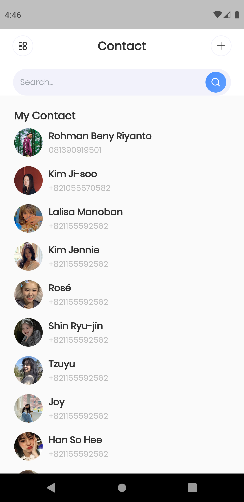

# (22) Flutter Animation
| NAMA |  KELAS
|--|--|
| Rohman Beny Riyanto  |  Flutter A

## Hasil Resume :

### 1. Flutter Animation
Animasi adalah kelas abstrak yang memahami nilai saat ini dan statusnya (selesai atau diberhentikan). Animation dalam flutter dapat membuat sebuah aplikasi terlihat lebih hidup.

### 2. Implicit animations
Dengan animasi implisit, Anda dapat menganimasikan properti widget dengan menetapkan nilai target; setiap kali nilai target berubah, widget menganimasikan properti dari nilai lama ke nilai baru . Dengan cara ini, animasi implisit menukar kontrol untuk kenyamanan—mereka mengelola efek animasi sehingga Anda tidak perlu melakukannya.

### 3. Flutter Transition
Transisi tidak lain adalah memindahkan suatu objek dari satu tempat ke tempat lain . Dalam flutter, itu juga sama tetapi dalam hal widget seperti wadah, tombol, dan juga halaman karena semua yang ada di flutter itu sendiri adalah widget.

# Task
Pada task ini saya menerapkan dua animation, yaitu animation untuk merubah gambar agar dapat berubah ukuran saat di tekan, kedua adalah animation transition (FADE).

Berikut hasil dari praktikum ini :

[View Program](https://github.com/RohmanBenyRiyanto/flutter_rohman-beny-riyanto/tree/main/22_Flutter%20Animation/praktikum/praktikum_22)<br>
[View Screenshot](https://github.com/RohmanBenyRiyanto/flutter_rohman-beny-riyanto/tree/main/22_Flutter%20Animation/screenshot)

## 1. Task Nomor 1
Pada task pertama ini saya membuat sebuah halaman scaffold dengan body center, di dalam center saya tambahkan child animated container.

### Source Code : 
```dart
/// NOTE : Properti boolean
bool isTapped = false;

/// NOTE : Gesture detector agar gambar dapat ditekan
GestureDetector(
          onTap: () {
            setState(
              () {
                isTapped = !isTapped;
              },
            );
          },
          child : AnimatedContainer(
                height: isTapped ? 200.0 : 100.0, // Pengondisian ukuran
                width: isTapped ? 200.0 : 100.0, // Pengondisian ukuran
                duration: const Duration(seconds: 2), // durasi perubahan terjadi
                curve: Curves.fastOutSlowIn,
                decoration: const BoxDecoration(
                  image: DecorationImage(
                    image: NetworkImage(
                        'https://i.pinimg.com/236x/a2/31/01/a2310147775da5802d3e2b5ba458bdd8.jpg',),
                    fit: BoxFit.cover,
                  ),
                ),
              ),
)
```

### Ouput :
[](https://github.com/RohmanBenyRiyanto/flutter_rohman-beny-riyanto/blob/main/22_Flutter%20Animation/screenshot/Demo%20Video.mkv)

## 2. Task Nomor 2
Pada task ini saya menambahkan animation pada navigator.

### Source Code :
```dart
Navigator.of(context).push(
                  PageRouteBuilder(
                    pageBuilder: (context, animation, secondaryAnimation) {
                      return const ImageAnimation();
                    },
                    transitionsBuilder:
                        (context, animation, secondaryAnimation, child) {
                      return FadeTransition(
                        opacity: animation,
                        child: child,
                      );
                    },
                  ),
                );

Navigator.of(context).push(
                  PageRouteBuilder(
                    pageBuilder: (context, animation, secondaryAnimation) {
                      return const AddContact();
                    },
                    transitionsBuilder:
                        (context, animation, secondaryAnimation, child) {
                      return FadeTransition(
                        opacity: animation,
                        child: child,
                      );
                    },
                  ),
                );
```

### Output :
[](https://github.com/RohmanBenyRiyanto/flutter_rohman-beny-riyanto/blob/main/22_Flutter%20Animation/screenshot/Demo%20Video.mkv)  [](https://github.com/RohmanBenyRiyanto/flutter_rohman-beny-riyanto/blob/main/22_Flutter%20Animation/screenshot/Demo%20Video.mkv) 